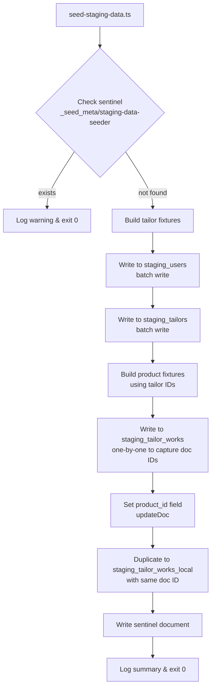

# Design Document: Staging Data Seeder

## Overview

The Staging Data Seeder is a standalone TypeScript script (`scripts/seed-staging-data.ts`) that populates Firebase Firestore staging collections with realistic mock data for the Stitches Africa platform. It uses the existing `lib/firebase-admin.ts` Admin SDK setup and follows the same patterns as other scripts in the `scripts/` directory.

The script seeds:
- 5 tailor accounts (3 main tailors + 2 sub-tailors) into `staging_users` and `staging_tailors`
- 10+ products (mix of bespoke and ready-to-wear) into `staging_tailor_works` and `staging_tailor_works_local`

It is a one-time seed script protected by an idempotency sentinel document.

---

## Architecture



---

## Components and Interfaces

### Script Entry Point

`scripts/seed-staging-data.ts` — single file, no external modules beyond `lib/firebase-admin.ts` and `dotenv`.

### Tailor Fixture Builder

A pure function `buildTailorFixtures()` that returns an array of `TailorFixture` objects. No I/O.

```typescript
interface TailorFixture {
  id: string;           // pre-generated UUID used as Firestore doc ID
  userData: StagingUser;
  tailorData: StagingTailor;
}

interface StagingUser {
  first_name: string;
  last_name: string;
  email: string;
  is_tailor: boolean;
  is_sub_tailor: boolean;
  role: string;
  tailorId: string;
  createdAt: string;
  phone: string;
  address: string;
  shop_name: string;
  status: "active" | "inactive";
}

type StagingTailor = StagingUser; // mirrors staging_users for main tailors
```

### Product Fixture Builder

A pure function `buildProductFixtures(tailorFixtures: TailorFixture[])` that returns an array of `ProductFixture` objects. Receives tailor fixtures so it can assign `tailor_id` values.

```typescript
interface ProductFixture {
  data: StagingProduct;
}

interface StagingProduct {
  tailor_id: string;
  type: "bespoke" | "ready-to-wear";
  title: string;
  price: { base: number; discount?: number; currency: string };
  discount: number;
  description: string;
  category: "men" | "women" | "kids" | "unisex";
  wear_category: string;
  wear_quantity: number;
  tags: string[];
  keywords: string[];
  images: string[];
  sizes: { size: string; quantity: number }[];
  customSizes: boolean;
  userCustomSizes: any[];
  userSizes: any[];
  tailor: string;
  status: "initiated" | "verified";
  availability: string;
  deliveryTimeline: string;
  createdAt: string;
  approvalStatus: "pending" | "approved" | "rejected";
  metric_size_guide: null;
  rtwOptions: RtwOptions | null;
  bespokeOptions: BespokeOptions | null;
  shipping: ShippingInfo;
  enableMultiplePricing?: boolean;
  individualItems?: any[];
  product_id: string; // set after Firestore write
}
```

### Seeder Orchestrator

The `main()` async function that:
1. Loads env via `dotenv`
2. Checks sentinel
3. Calls fixture builders
4. Writes tailors in a Firestore batch
5. Writes products one-by-one (to capture auto-generated doc IDs), then updates `product_id`
6. Duplicates products to `staging_tailor_works_local`
7. Writes sentinel
8. Logs summary

---

## Data Models

### Mock Tailors (5 total)

| ID Alias | Name | Shop | Type | Role |
|---|---|---|---|---|
| tailor_1 | Emeka Okafor | Adire Couture Lagos | Main | — |
| tailor_2 | Amara Mensah | Kente Kings Accra | Main | — |
| tailor_3 | Fatima Al-Hassan | Sahel Stitch Abuja | Main | — |
| sub_1 | Chidi Nwosu | (under tailor_1) | Sub | initiator |
| sub_2 | Yetunde Bello | (under tailor_2) | Sub | approver |

### Mock Products (10 total)

| Title | Type | Category | Wear Category | Tailor |
|---|---|---|---|---|
| Royal Agbada Set | bespoke | men | Agbada | tailor_1 |
| Ankara Wrap Dress | ready-to-wear | women | Ankara | tailor_1 |
| Kente Ceremony Suit | bespoke | men | Kente | tailor_2 |
| Dashiki Festival Shirt | ready-to-wear | unisex | Dashiki | tailor_2 |
| Aso-Oke Bridal Gele Set | bespoke | women | Aso-Oke | tailor_3 |
| Kaftan Lounge Wear | ready-to-wear | men | Kaftan | tailor_3 |
| Boubou Grand Occasion | bespoke | unisex | Boubou | tailor_1 |
| Ankara Kids Playsuit | ready-to-wear | kids | Ankara | tailor_2 |
| Adire Tie-Dye Blouse | bespoke | women | Adire | tailor_3 |
| Kente Kids Outfit | ready-to-wear | kids | Kente | tailor_3 |

### Sentinel Document

Collection: `_seed_meta`
Document ID: `staging-data-seeder`

```json
{
  "seededAt": "<ISO timestamp>",
  "version": "1.0.0",
  "tailorsSeeded": 5,
  "productsSeeded": 10
}
```

---

## Correctness Properties

*A property is a characteristic or behavior that should hold true across all valid executions of a system — essentially, a formal statement about what the system should do. Properties serve as the bridge between human-readable specifications and machine-verifiable correctness guarantees.*

### Property 1: Tailor document schema invariant

*For any* tailor document written by the Seeder, the document must contain all required fields (`first_name`, `last_name`, `email`, `is_tailor`, `is_sub_tailor`, `role`, `tailorId`, `createdAt`, `phone`, `address`, `shop_name`, `status`), `status` must equal `"active"`, main tailors must have `is_tailor: true` and `is_sub_tailor: false`, sub-tailors must have `is_tailor: false` and `is_sub_tailor: true`, and sub-tailor `role` must be one of `["initiator", "approver"]`.

**Validates: Requirements 2.3, 2.4, 2.5, 2.7, 2.8**

---

### Property 2: staging_tailors correspondence invariant

*For any* main tailor document written to `staging_users`, there must exist a document in `staging_tailors` with the identical document ID and all the same fields.

**Validates: Requirements 3.1, 3.2, 3.3**

---

### Property 3: Product document schema invariant

*For any* product document written by the Seeder, the document must contain all required fields, `approvalStatus` must equal `"pending"`, `price.currency` must equal `"NGN"`, `product_id` must equal the Firestore document ID, bespoke products must have `rtwOptions: null` and a populated `bespokeOptions`, and ready-to-wear products must have `bespokeOptions: null` and a populated `rtwOptions`.

**Validates: Requirements 4.5, 4.6, 4.7, 4.9, 4.11, 4.12**

---

### Property 4: Product status conditional invariant

*For any* product document written by the Seeder, if the product's `tailor_id` belongs to a main tailor then `status` must equal `"verified"`, and if it belongs to a sub-tailor then `status` must equal `"initiated"`.

**Validates: Requirements 4.10**

---

### Property 5: Product duplication correspondence

*For any* product document written to `staging_tailor_works`, there must exist a document in `staging_tailor_works_local` with the identical document ID and `product_id` field.

**Validates: Requirements 5.1, 5.2**

---

### Property 6: Idempotency guard

*For any* run of the Seeder where the sentinel document already exists in `_seed_meta/staging-data-seeder`, the Seeder must not write any new documents to `staging_users`, `staging_tailors`, `staging_tailor_works`, or `staging_tailor_works_local`.

**Validates: Requirements 6.2**

---

### Property 7: Seeded collection coverage invariants

*For any* successful run of the Seeder:
- The count of documents with `is_tailor: true` in `staging_users` must be >= 3
- The count of documents with `is_sub_tailor: true` in `staging_users` must be >= 2
- The count of documents in `staging_tailor_works` must be >= 10
- The set of distinct `tailor_id` values across products must have cardinality >= 3
- The set of distinct `type` values must include both `"bespoke"` and `"ready-to-wear"` with each having count >= 4
- The set of distinct `category` values must equal `{"men", "women", "kids", "unisex"}`

**Validates: Requirements 2.1, 2.2, 4.1, 4.2, 4.3, 4.4**

---

## Error Handling

- **Sentinel exists**: Log warning, exit 0 (not an error).
- **Firestore write failure (tailors)**: Log error, exit 1. Tailor writes are prerequisite for products.
- **Firestore write failure (products, main collection)**: Log error, exit 1.
- **Firestore write failure (staging_tailor_works_local)**: Log warning, continue. Mirrors the behavior in `addTailorWork.ts`.
- **Missing credentials**: `lib/firebase-admin.ts` handles credential loading; the script will fail at Firestore access time with a clear Firebase error.

---

## Testing Strategy

### Unit Tests

Unit tests verify specific examples and edge cases using Vitest with Firestore mocked via `jest.fn()` / `vi.fn()`:

- Verify `buildTailorFixtures()` returns exactly 5 fixtures with correct field shapes
- Verify `buildProductFixtures()` returns exactly 10 fixtures with correct field shapes
- Verify the idempotency guard exits early when sentinel exists (mock `adminDb.doc().get()` to return `exists: true`)
- Verify `staging_tailor_works_local` failure is non-fatal (mock the local collection write to throw, assert main write still returns success)

### Property-Based Tests

Property tests use `fast-check` (already in `devDependencies`) to validate universal correctness properties. Each test runs a minimum of 100 iterations.

- **Property 1** — Generate arbitrary arrays of tailor fixture objects and assert the schema invariant holds for every element.
  - Tag: `Feature: staging-data-seeder, Property 1: tailor document schema invariant`

- **Property 3** — Generate arbitrary product fixture objects (both bespoke and RTW) and assert the schema invariant holds.
  - Tag: `Feature: staging-data-seeder, Property 3: product document schema invariant`

- **Property 4** — Generate arbitrary (product, tailor type) pairs and assert the status conditional invariant holds.
  - Tag: `Feature: staging-data-seeder, Property 4: product status conditional invariant`

- **Property 6** — Simulate the sentinel check with arbitrary Firestore mock states and assert no writes occur when sentinel is present.
  - Tag: `Feature: staging-data-seeder, Property 6: idempotency guard`

Properties 2, 5, and 7 are validated by integration-style unit tests that run the full `main()` function against a mocked Firestore and assert post-conditions on the mock call arguments.
