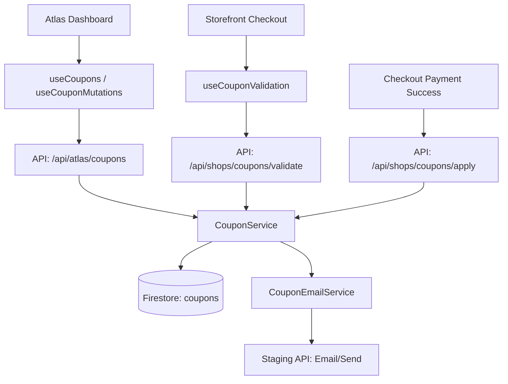

# Email-Tied Coupon System: Technical Walkthrough

This document provides a comprehensive overview of how the email-tied coupon system is implemented across the Stitches Africa dashboard (Atlas) and the storefront.

## 1. System Overview
The system allows Atlas administrators to create discount coupons that are tied to a specific customer's email address. These coupons can be used during the storefront checkout process to apply percentage or fixed discounts.

---

## 2. Architecture & Components

---

## 3. Key Services (`lib/atlas/`)

### [CouponService.ts](file:///Users/jeffreybenson/Documents/stitchesafricamobile.dashboard/lib/atlas/coupon-service.ts)
The heart of the system. It handles:
- **Generation**: Creates unique codes like `STIT-XXXXXX`.
- **CRUD Operations**: Creation with parameters (discount type, value, expiry, assigned email).
- **Validation**: Strict checks for:
  - Coupon existence and `ACTIVE` status.
  - Expiry date comparison.
  - Usage limits vs. `timesUsed`.
  - **Email Tying**: Ensures the input email strictly matches the `assignedEmail`.
  - **Minimum Order**: Validates the cart total meets requirements.
- **Consumption**: Atomically increments `timesUsed` and records usage in `usageHistory`.

### [CouponEmailService.ts](file:///Users/jeffreybenson/Documents/stitchesafricamobile.dashboard/lib/atlas/coupon-email-service.ts)
Sends notifications to customers when they receive a coupon.
- Integrates with the `stitchesafrica.com` staging email API.
- Uses the [couponTemplate.ts](file:///Users/jeffreybenson/Documents/stitchesafricamobile.dashboard/lib/emailTemplates/couponTemplate.ts) for consistent branding.

---

## 4. Frontend Hooks (`hooks/`)

| Hook | Purpose | Location |
| :--- | :--- | :--- |
| `useCoupons` | Fetching listing with filters/pagination. | Atlas Admin |
| `useCouponMutations` | Create, update, delete, resend emails. | Atlas Admin |
| `useCouponValidation` | Validates code against email & cart total. | Checkout Page |

---

## 5. Checkout Integration Flow

The integration in [checkout/page.tsx](file:///Users/jeffreybenson/Documents/stitchesafricamobile.dashboard/app/shops/checkout/page.tsx) follows this cycle:

1.  **Input**: User enters code in [CouponInput.tsx](file:///Users/jeffreybenson/Documents/stitchesafricamobile.dashboard/components/checkout/CouponInput.tsx).
2.  **Validation**: `useCouponValidation` calls `/api/shops/coupons/validate`. It requires a Firebase Auth ID token for security.
3.  **Preview**: If valid, [DiscountSummary.tsx](file:///Users/jeffreybenson/Documents/stitchesafricamobile.dashboard/components/checkout/DiscountSummary.tsx) displays the savings.
4.  **Recalculation**: The final order total is updated in real-time.
5.  **Finalization**: On successful payment (e.g., `handleStripePaymentSuccess`), a call is made to `/api/shops/coupons/apply` to permanently mark the coupon as used.

---

## 6. Firestore Schema (`coupons` collection)

| Field | Type | Description |
| :--- | :--- | :--- |
| `couponCode` | `string` | Unique identifier (e.g., STIT-A1B2C3) |
| `assignedEmail` | `string` | Owner's email (lowercase) |
| `discountType` | `string` | `PERCENTAGE` or `FIXED` |
| `discountValue` | `number` | % amount or value in NGN |
| `usageLimit` | `number` | Max times it can be used (usually 1) |
| `timesUsed` | `number` | Current usage count |
| `status` | `string` | `ACTIVE`, `USED`, `EXPIRED`, `INACTIVE` |
| `usageHistory` | `Array` | Logs of `orderId`, `usedAt`, `discountApplied` |

---

## 7. Security & Business Rules
- **Tying**: A coupon cannot be "guessed" and used by another person because it validates against the logged-in user's email.
- **Rate Limiting**: The validation API limits a user to 10 attempts per minute to prevent brute-forcing.
- **Atomic updates**: Prevents race conditions where a customer might try to use a single-use coupon multiple times simultaneously.
